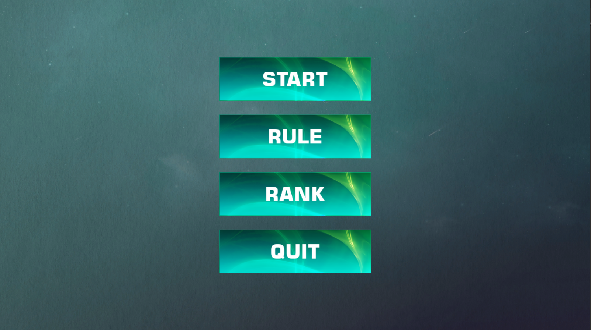
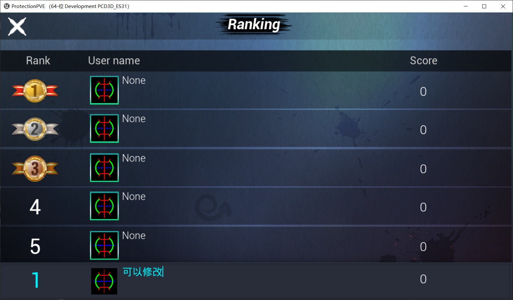
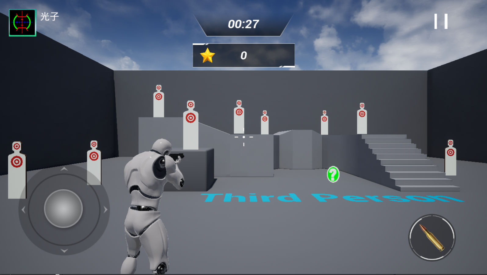
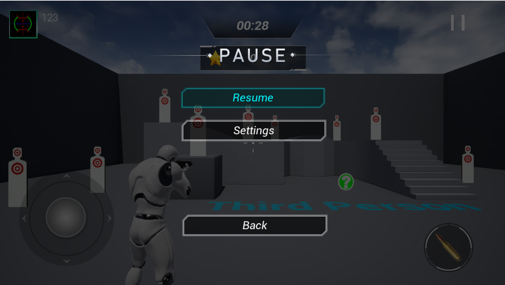
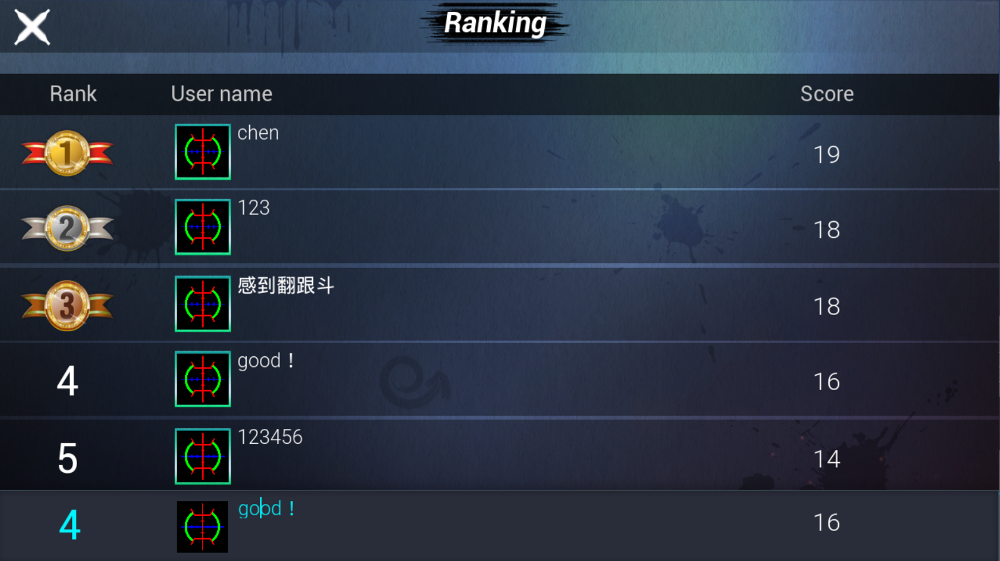

# UMGTest

## 简介

一个安卓端的UE4 UMG界面测试项目

游戏演示及apk：

https://pan.baidu.com/s/1mf-L61_C5UEablj_RPJrIg 提取码：2048

## UI使用说明

### 主菜单

包含以下4个按钮：

开始游戏：点击开始游戏后，玩家需要输入自己的昵称，之后点击OK进入游戏游玩

规则说明：显示一段规则说明文字

排行榜：显示在本机器上游玩过的玩家分数，其中只有得分前5名的玩家会显示在排行榜上方，最后一栏只有玩家游玩结算时才会显示该玩家的得分数据和姓名，**并且该栏的姓名可以更改！（游戏演示时没有录进去）**

退出游戏：点击退出按钮后，会弹出一个提示框，选择确认立即退出，否则返回主菜单

### 游戏内UI

在输入玩家姓名后，玩家便进入游戏游玩，游戏内的UI如上图所示

其中，左上角包含玩家的个人信息，即头像和名称（头像暂时不可配置）

最上方是一个倒计时，显示距离游戏结束还剩多长时间

倒计时下方是计分板，玩家击中一次目标后，计分板计数加一

左下角是控制玩家移动的虚拟按键，除此之外，玩家直接通过滑动屏幕调整视角

右下角按钮用于射击

右上角是暂停键，点击后显示如下图所示的界面，同时游戏倒计时暂停：

该界面中，Resume按键回到游戏，Settings按键打开设置菜单，Back按键回到开始菜单

### 排行榜

游戏结束后，会在最后一栏显示该玩家的排名以及得分，上方显示前5名高分玩家的得分，可以看到，这次玩家的排名是第4名，成功上榜：

